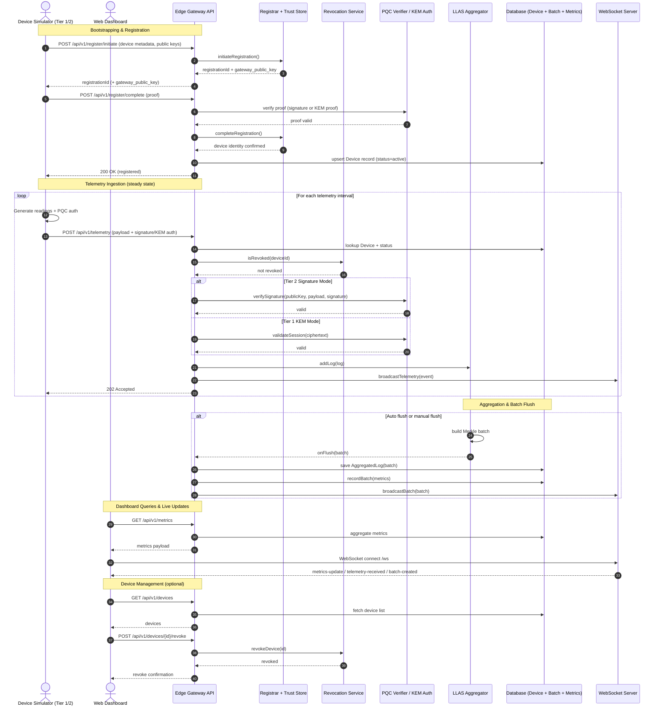

# System Design: End-to-End Sequence Diagram

## Mermaid Sequence Diagram

## Theoretical Report on the Sequence Diagram

### 1) Purpose and Scope
This sequence diagram models the end-to-end behavior of the project: from device onboarding and PQC-based authentication to telemetry ingestion, aggregation, persistence, and live visualization. It reflects the interaction between the device simulator, the edge gateway API, the cryptographic verification flow, aggregation (LLAS), storage, and the dashboard’s real-time view.

### 2) Actors and Responsibilities
- **Device Simulator (Tier 1/2)**: Generates sensor telemetry. Tier 1 uses KEM-based authentication; Tier 2 uses PQC signatures. See `DeviceSimulator` in [backend/services/device-simulator/src/device.py](backend/services/device-simulator/src/device.py).
- **Edge Gateway API**: Central orchestration and validation pipeline for registration, telemetry, and metrics. Primary routes in [backend/services/edge-gateway/src/routes.js](backend/services/edge-gateway/src/routes.js).
- **Registrar + Trust Store**: Manages device identity, registration flow, and device metadata lifecycle.
- **Revocation Service**: Maintains revocation state and blocks compromised devices.
- **PQC Verifier / KEM Auth**: Validates PQC signatures or KEM-based authentication. See [backend/services/edge-gateway/src/crypto/verifier.js](backend/services/edge-gateway/src/crypto/verifier.js) and [backend/services/edge-gateway/src/crypto/kem-auth.js](backend/services/edge-gateway/src/crypto/kem-auth.js).
- **LLAS Aggregator**: Collects logs and emits aggregated Merkle batches on flush. See [backend/services/edge-gateway/src/modules/aggregation/llas.js](backend/services/edge-gateway/src/modules/aggregation/llas.js).
- **Database**: Persists devices, aggregated logs, and metrics. Models in [backend/services/edge-gateway/src/models](backend/services/edge-gateway/src/models).
- **WebSocket Server**: Streams real-time metrics and events to the dashboard. See `initWebSocketServer` in [backend/services/edge-gateway/src/websocket.js](backend/services/edge-gateway/src/websocket.js).
- **Web Dashboard**: Consumes REST metrics and WebSocket events to display live system state.

### 3) Registration Flow (Bootstrapping)
The registration sequence is a two-phase exchange that establishes device identity and cryptographic trust:
1. **Initiate**: The device sends metadata (device ID, tier, algorithm, public keys). The gateway uses `initiateRegistration()` to create a registration ID and (optionally) returns a gateway public key for Tier 1 KEM bootstrap.
2. **Complete**: The device submits a proof. Tier 2 produces a signature over the registration challenge; Tier 1 returns KEM-oriented proof. The gateway validates this via `verifySignature()` or a KEM validation routine.
3. **Persist**: Once validated, the device record is upserted into the database and marked active. This allows telemetry ingestion to proceed.

This design supports heterogeneous device capabilities while maintaining a consistent, verifiable onboarding path.

### 4) Telemetry Ingestion Flow
After registration, the device enters a continuous telemetry loop:
- **Data generation**: The simulator produces readings using the sensor mock and constructs a structured payload.
- **Authentication**:
  - *Tier 2*: Computes a PQC signature over the payload.
  - *Tier 1*: Uses a KEM encapsulation flow to produce an authentication artifact.
- **Gateway validation**: The gateway checks device existence, revocation status, and authentication validity. Invalid devices or signatures are rejected early.
- **Aggregation enqueue**: Valid logs are appended to LLAS via `addLog()`.
- **Realtime telemetry broadcast**: A lightweight event is sent over WebSocket for live traffic visualization.
- **Accepted response**: The gateway returns 202 to keep device-side latency low.

This flow decouples cryptographic verification, aggregation, and persistence while preserving correctness and responsiveness.

### 5) Aggregation and Batch Flush
LLAS implements log-level aggregation to reduce bandwidth and storage overhead:
- Logs are buffered and organized into a Merkle tree batch.
- On flush, a batch is emitted to the gateway’s `onFlush()` handler.
- The batch is persisted in the database and recorded in aggregation metrics.
- A `batch-created` event is broadcast to the dashboard for live updates.

This mechanism enables both **H2A mode** (aggregated) and **baseline mode** (pass-through) without changing the ingestion protocol.

### 6) Metrics, Observability, and Live Dashboard
The system supports both pull and push observability:
- **Pull**: The dashboard calls `/api/v1/metrics` to fetch an aggregated snapshot.
- **Push**: The WebSocket server periodically emits `metrics-update` events and other domain events (telemetry received, batch created).

This dual approach ensures reliable dashboards even when WebSocket connections are intermittent.

### 7) Trust and Security Considerations
- **Post-Quantum Cryptography**: Tiered PQC allows resource-constrained devices to authenticate without expensive signatures, while more capable devices provide full signature guarantees.
- **Revocation checks**: Every telemetry submission is gated by revocation status.
- **Integrity**: Signatures or KEM proofs bind payloads to device identity and prevent spoofing.
- **Aggregation integrity**: Merkle batching provides tamper-evident aggregation results.

### 8) Failure Modes and Recovery
- **Registration failure**: The device can retry; the gateway returns a non-2xx response if proof validation fails.
- **Invalid signatures/KEM**: Telemetry is rejected with a 401/403 class response.
- **Aggregation backlog**: LLAS can be flushed manually via `/api/v1/aggregation/flush`.
- **WebSocket disconnects**: The dashboard can reconnect and fetch state via REST.

### 9) Design Rationale Summary
The sequence diagram reflects a design optimized for PQC-aware IoT systems:
- Clear separation of concerns (auth, ingestion, aggregation, storage, visualization).
- Event-driven streaming for real-time insights.
- Mode-aware operation (H2A vs baseline) for empirical comparisons.

### 10) Implementation References
- Registration and telemetry routes: [backend/services/edge-gateway/src/routes.js](backend/services/edge-gateway/src/routes.js)
- Gateway initialization and flush hook: [backend/services/edge-gateway/src/app.js](backend/services/edge-gateway/src/app.js)
- WebSocket streaming: [backend/services/edge-gateway/src/websocket.js](backend/services/edge-gateway/src/websocket.js)
- Device simulator flow: [backend/services/device-simulator/src/device.py](backend/services/device-simulator/src/device.py)
- PQC engine: [backend/services/device-simulator/src/crypto/pqc_engine.py](backend/services/device-simulator/src/crypto/pqc_engine.py)
